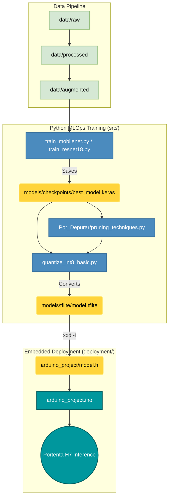

# TinyML-MLOps Framework for ARM Cortex-M7


An open-source, highly structured MLOps pipeline designed to optimize and deploy Deep Learning and Computer Vision models on resource-constrained microcontrollers (specifically the **Arduino Portenta H7**).

---

##  Overview

The **TinyML-MLOps Framework** bridges the gap between high-level Python model training and static, memory-constrained C++ embedded execution. It enforces strict data lifecycles, artifact management, and state-of-the-art compression pipelines (Pruning & Quantization) for deployment at the "Far Edge".

###  Key Features
- **Transfer Learning Support:** Automated pipelines for training advanced architectures including `MobileNetV2`, `MobileNetV3`, `ResNet18`, and `SqueezeNet`.
- **Object Detection at the Edge:** Natively supports training **FOMO** (Faster Objects, More Objects) for low-power visual detection.
- **Advanced Model Compression:** Built-in scripts for Polynomial Decay Pruning, Layer-Specific Sparse constraints, and Full Integer Quantization (INT8) to shrink models by up to 4x.
- **Hardware-in-the-Loop Integration:** Includes real-time serial streaming scripts to visualize live raw pixels captured directly from the Portenta H7 Vision Shield.
- **Academic Reproducibility:** Version-controlled models, dynamic TensorBoard logging, and rigid data hierarchies (`raw/`, `processed/`, `augmented/`).

---

##  Architecture & MLOps Pipeline

The project rigorously separates Data Science environments (`src/`) from Embedded Engineering firmware (`deployment/`).



---

##  Quickstart & Usage

### 1. Prerequisites & Installation
Ensure you are using Python 3.10+ and install the dependencies:
```bash
git clone https://github.com/F4bian1012/Investigacion.git
cd Investigacion
pip install -r requirements.txt
```

### 2. Data Preparation
Place your raw image dataset inside `data/raw/` (organized by class subfolders), then process and resize them:
```bash
python src/process_images.py
python src/reshape_images.py --width 96 --height 96
```

### 3. Model Training
Train a state-of-the-art vision architecture (e.g., MobileNetV2) using the command-line interface. The script will dynamically generate checkpoints and TensorBoard logs.
```bash
python src/train_mobilenet.py --base_model MobileNetV2 --width 96 --height 96 --batch_size 32 --epochs 20 --learning_rate 0.0001
```

*For ResNet18, SqueezeNet, or FOMO, run `src/train_resnet18.py`, `src/train_squeezenet.py`, or `src/train_fomo.py` respectively.*

### 4. Model Evaluation
Evaluate your `.keras` model, automatically generating a Confusion Matrix and extensive statistical metrics (F1-score, Precision, Recall):
```bash
python src/test_model.py --width 96 --height 96
```

### 5. Optimization & INT8 Quantization
Convert the float32 Keras model into an ultra-lightweight integer-only TFLite model, strictly necessary for MCUs without a vector FPU:
```bash
python src/quantize_int8_basic.py
```
*Note: You can validate the quantized model against the dataset using `python src/test_tflite_model.py`.*

### 6. Embedded Deployment
Once the model is optimized, convert the `.tflite` file into a C-array header for the Arduino IDE:
```bash
xxd -i models/tflite/model_int8.tflite > deployment/arduino_project/model.h
```
Finally, compile and flash `deployment/arduino_project/arduino_project.ino` using the Arduino IDE.

---

##  Experimental Sandbox (`src/Por_Depurar/`)
The `Por_Depurar/` directory is dedicated to experimental model optimization research:
- **`pruning_techniques.py`**: Explores Polynomial Decay and Layer-specific sparsity to reduce weight footprint.
- **`quantization_techniques.py`**: Compares Dynamic Range, Full Integer, Float16, and Quantization-Aware Training (QAT).
- **Legacy Baselines**: Contains the foundational `train_model.py` demonstrating a custom, from-scratch micro-CNN.

---

##  Real-time Hardware Vision
We provide an end-to-end loop for raw data collection using the Arduino Portenta Vision Shield.
1. Flash `deployment/arduino/image_capture/image_capture.ino` to the Portenta H7.
2. Run the Python visualizer to view live serial pixel data (160x120 Grayscale at 30fps):
```bash
python src/visualize_serial_image.py
```

---

## Citation

If you use this framework in your academic research, please cite our upcoming *SoftwareX* paper:

```bibtex
@article{tinyml_mlops_2026,
  title={TinyML-MLOps: An Open-Source Structured Framework for Optimizing and Deploying Convolutional Neural Networks on ARM Cortex-M7 Microcontrollers},
  author={[First Author] and [Second Author]},
  journal={},
  year={},
  publisher={}
}
```

---
*Created for the tiny edge. Maintained by [F4bian1012](https://github.com/F4bian1012).*
