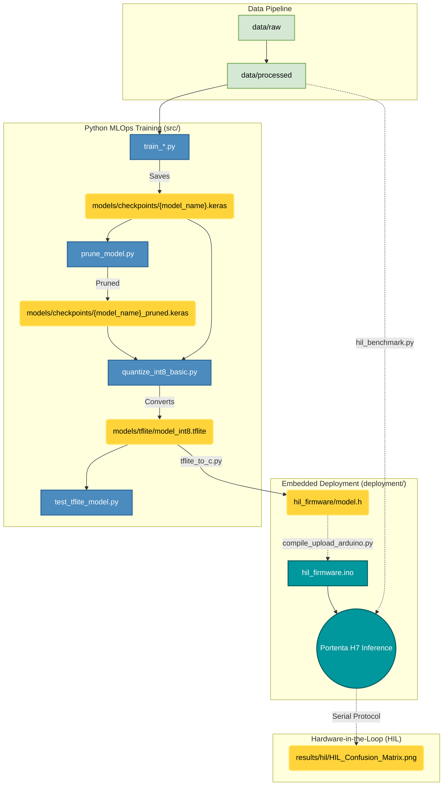

# TinyML-MLOps Framework for ARM Cortex-M7


An open-source, highly structured MLOps pipeline designed to optimize and deploy Deep Learning and Computer Vision models on resource-constrained microcontrollers (specifically the **Arduino Portenta H7**).

---

## Table of Contents
- [Overview](#overview)
  - [Key Features](#key-features)
- [Architecture & MLOps Pipeline](#architecture--mlops-pipeline)
  - [Repository Structure](#repository-structure)
- [Serial Protocol (HIL Bench)](#serial-protocol-hil-bench)
- [Core Scripts Overview (`src/`)](#core-scripts-overview-src)
  - [1. Data Engineering](#1-data-engineering)
  - [2. Model Training (ML Pipelines)](#2-model-training-ml-pipelines)
  - [3. Model Optimization & Evaluation](#3-model-optimization--evaluation)
  - [4. Embedded Conversion & Deployment](#4-embedded-conversion--deployment)
- [Hardware Requirements](#hardware-requirements)
- [Quickstart & Usage](#quickstart--usage)
  - [1. Prerequisites & Installation](#1-prerequisites--installation)
  - [2. Data Preparation](#2-data-preparation)
  - [3. Model Training](#3-model-training)
  - [4. Model Evaluation](#4-model-evaluation)
  - [5. Optimization & INT8 Quantization](#5-optimization--int8-quantization)
  - [6. Embedded Deployment](#6-embedded-deployment)
  - [7. Hardware-in-the-Loop Evaluation](#7-hardware-in-the-loop-evaluation)
- [Experimental Sandbox (`src/Por_Depurar/`)](#experimental-sandbox-srcpor_depurar)
- [Citation](#citation)

---

##  Overview

The **TinyML-MLOps Framework** bridges the gap between high-level Python model training and static, memory-constrained C++ embedded execution. It enforces strict data lifecycles, artifact management, and state-of-the-art compression pipelines (Pruning & Quantization) for deployment at the "Far Edge".

###  Key Features
- **Transfer Learning Support:** Automated pipelines for training advanced architectures including `MobileNetV2`, `MobileNetV3`, `ResNet18`, and `SqueezeNet`.
- **Advanced Model Compression:** Built-in scripts for Polynomial Decay Pruning, Layer-Specific Sparse constraints, and Full Integer Quantization (INT8) to shrink models by up to 4x.
- **Hardware-in-the-Loop Integration:** Includes real-time serial streaming scripts to visualize live raw pixels captured directly from the Portenta H7 Vision Shield.
- **Academic Reproducibility:** Version-controlled models, dynamic TensorBoard logging, and rigid data hierarchies (`raw/`, `processed/`).

---

##  Architecture & MLOps Pipeline

### Repository Structure
```text
Investigacion/
├── data/                    # Local datasets (ignored in git)
│   ├── raw/                 # Raw unprocessed images
│   └── processed/           # Resized & grayscale images
├── deployment/              # C++ Firmware for edge deployment
│   └── hil_firmware/        # Portenta H7 Hardware-in-the-Loop firmware
├── models/                  # Generated Keras and TFLite models
│   ├── checkpoints/         # Trained .keras models
│   └── tflite/              # Quantized .tflite models
├── src/                     # Core Python MLOps scripts
│   ├── process_images.py    
│   ├── reshape_images.py    
│   ├── train_*.py           # Training pipelines (MobileNet, ResNet, SqueezeNet)
│   ├── prune_model.py       
│   ├── quantize_int8_basic.py
│   ├── test_model.py        
│   ├── test_tflite_model.py 
│   ├── tflite_to_c.py       
│   ├── compile_upload_arduino.py
│   ├── hil_benchmark.py
│   └── Por_Depurar/         # Experimental and legacy scripts
├── tensorboard_logs/        # Automated TF training logs
├── installed_packages.txt   # Pip freeze snapshot
├── requirements.txt         # Core dependencies & Hardware setup
└── README.md
```

The project rigorously separates Data Science environments (`src/`) from Embedded Engineering firmware (`deployment/`).



---

## Serial Protocol (HIL Bench)

The HIL bench streams a full image from the host to the Portenta H7 over USB
Serial, runs on-device inference, and reads the predicted class back. The wire
format is a framed raw-byte protocol:

| Element        | Value            | Meaning                                        |
|----------------|------------------|------------------------------------------------|
| Start marker   | `#` (`0x23`)     | Begin of image packet                          |
| End marker     | `@` (`0x40`)     | End of image packet → triggers inference       |
| Escape byte    | `ESC` (`0x1B`)   | Next byte is real data, recovered as `b ^ 0x20`|
| Baud rate      | `115200`         | `Serial.begin(115200)`                         |

**Encoding rule.** Image pixels are sent raw between the markers. If a pixel byte
equals `#`, `@`, or `ESC`, the sender escapes it as `ESC` followed by
`byte ^ 0x20`, so control bytes never appear inside the payload. The firmware
reverses this on reception (`hil_benchmark.py` performs the escaping on the host
side).

**Input handling.** Received bytes (uint8, 0–255) are written into the model
input tensor. For an INT8 model each pixel is mapped as `int8 = pixel - 128`;
for a FP32 model as `float = pixel / 255.0`. If fewer bytes than the tensor
expects arrive, the remainder is zero-padded.

**Response.** After `Invoke()`, the board prints the predicted class index as a
single integer line (argmax of the output tensor). Diagnostic banners and the
on-chip CPU temperature (`°C`, from STM32H7 factory calibration) are also printed
around each inference; `hil_benchmark.py` parses the integer class from the stream.

---

## Core Scripts Overview (`src/`)

The framework relies on a suite of production-ready scripts in `src/` to automate the complete MLOps workflow:

### 1. Data Engineering
*   **`process_images.py`**: Converts raw dataset images (JPEG, PNG, BMP) to single-channel grayscale, applying optimized compression parameters (JPEG Quality: 70, PNG Compression: 9) to prevent bloating storage.
*   **`reshape_images.py`**: Recursively searches for images and resizes them to the target resolution required by models (e.g. `160x120`, `320x320`), storing the structured dataset in `data/processed/{width}x{height}`.

**Common Output Artifacts for Data Engineering:**
- **Grayscale Images**: `data/processed/grayscale/{class_name}/*.jpg` - The compressed, single-channel intermediate dataset.
- **Reshaped Datasets**: `data/processed/{width}x{height}/{class_name}/*.jpg` - The final model-ready dataset structured by resolution and class.

### 2. Model Training (ML Pipelines)
*   **`train_mobilenet.py`**: Training pipeline for MobileNet classification architectures (`MobileNet`, `MobileNetV2`, `MobileNetV3Large`, `MobileNetV3Small`) utilizing Transfer Learning from ImageNet weights, adapted to single-channel (grayscale) inputs and custom number of classes. Supports data augmentation and generates `.keras` models.
*   **`train_resnet.py`**: Training pipeline for ResNet classification architectures (`ResNet8`, `ResNet18`) adapted for tiny edge classification.
*   **`train_squeezenet.py`**: Training pipeline for the ultra-lightweight `SqueezeNet` architecture, offering a balance between size and accuracy.

**Common Output Artifacts for Training Scripts:**
- **Keras Model**: `models/checkpoints/{model_name}+{hyperparameters}.keras` - The trained FP32 model ready for evaluation or quantization.
- **Class Names**: `models/class_names.txt` - Ordered list of class labels derived from the dataset structure.
- **Training History Plot**: `tensorboard_logs/{model_name}_training_history+{hyperparameters}.png` - Matplotlib visualization of training/validation loss and accuracy.

### 3. Model Optimization & Evaluation
*   **`test_model.py`**: Evaluates Keras `.keras` models by generating core statistics (Accuracy, Precision, Recall, F1-Score) and exporting a detailed classification report alongside a saved Seaborn-based Confusion Matrix plot.
*   **`prune_model.py`**: Applies manual magnitude-based unstructured pruning (either globally or layer-wise) to sparsify weights in Conv2D and Dense layers. Calculates and outputs initial/final model sparsity.
*   **`quantize_int8_basic.py`**: Quantizes standard FP32 `.keras` models to full-INT8 `.tflite` format. Employs a representative dataset of 100 samples from the processed dataset to precisely calibrate activation scales and zero-points. Enforces strict INT8 input/output tensors for optimal MCU compatibility.
*   **`test_tflite_model.py`**: Validates full-INT8 `.tflite` quantized models sequentially. Simulates microcontroller execution constraints by performing manual input scaling/quantization and output dequantization dynamically, exporting a Seaborn-based Confusion Matrix.

**Common Output Artifacts for Optimization & Evaluation:**
- **Confusion Matrix (Keras)**: `models/checkpoints/Matriz_CM_{model_name}.png` - Visual evaluation of the floating-point model's predictions.
- **Pruned Model**: `models/checkpoints/{model_name}_pruned.keras` - The sparse representation of the model after magnitude pruning.
- **Quantized TFLite Model**: `models/tflite/{model_name}_int8.tflite` - The fully integer quantized, microcontroller-ready binary file.
- **Confusion Matrix (TFLite)**: `models/tflite/Matriz_CM_{model_name}_int8.png` - Visual evaluation of the quantized model simulating MCU arithmetic constraints.

### 4. Embedded Conversion & Deployment
*   **`tflite_to_c.py`**: Standardized converter utility that parses a `.tflite` binary file and outputs a C/C++ array header compatible with TFLite for Microcontrollers. Embeds a critical 16-byte alignment attribute (`DATA_ALIGN_ATTRIBUTE`) required for hardware accelerators and optimal execution on ARM Cortex-M7 (e.g., Arduino Portenta H7).
*   **`compile_upload_arduino.py`**: Automation utility that interacts directly with `arduino-cli` to compile and upload the firmware. It handles core installations (`arduino:mbed_portenta`), auto-detects the connected board's COM port, and mitigates Windows path syntax issues natively.
*   **`hil_benchmark.py`**: A robust hardware-in-the-loop evaluation script. It sends preprocessed dataset images to the Arduino Portenta via a custom Serial protocol (with byte escaping). It reads predictions back in real-time, matching them with the true folder-based classes to generate extensive statistical metrics and a Seaborn-based Confusion Matrix plot comparing Edge hardware inference with ground-truth.

---

## Hardware Requirements

| Component        | Specification                                                        |
|------------------|---------------------------------------------------------------------|
| Board            | Arduino Portenta H7 (STM32H747XI, dual-core Cortex-M7 @ 480 MHz)     |
| External RAM     | 8 MB SDRAM (required — tensor arena + image buffer live here)        |
| Camera (capture) | Portenta Vision Shield, HM01B0 monochrome sensor (160×120, 30 fps)   |
| Flash            | 2 MB internal (holds the quantized model via `model.h`)              |
| Host link        | USB-C, 115200 baud serial                                            |

**Memory configuration (firmware).** The tensor arena is allocated in **SDRAM**,
not internal SRAM:

- `kTensorArenaSize = 4 * 1024 * 1024` (**4 MB**), 16-byte aligned.
- Image receive buffer: `IMAGE_BUFFER_SIZE = 400 * 1024` (400 KB), sized for up
  to 320×320 inputs.
- Op resolution uses `AllOpsResolver` (all TFLite-Micro ops registered) to avoid
  `AllocateTensors()` failures from missing operators.

**Toolchain.** Arduino CLI + `arduino:mbed_portenta` core + `Chirale_TensorFlowLite`
library (see `requirements.txt`).

---

## Quickstart & Usage

### 1. Prerequisites & Installation
Ensure you are using Python 3.10+ and install the dependencies:
```bash
git clone https://github.com/F4bian1012/Investigacion.git
cd Investigacion
pip install -r requirements.txt
```

### 2. Data Preparation
Place your raw image dataset inside `data/raw/` (organized by class subfolders), 
```
data/raw/
├── Class1/
└── Class2/
```
then process (convert to grayscale) and resize them with recommended sizes: CAMERA_R160x120 (QQVGA), CAMERA_R320x240 (QVGA), CAMERA_R320x320. 
```bash
python src/process_images.py --raw_path data/raw --path_processed data/processed/grayscale
python src/reshape_images.py --width 160 --height 120
```

### 3. Model Training
Train a state-of-the-art vision architecture (e.g., MobileNetV2) using the command-line interface. The script will dynamically generate checkpoints and TensorBoard logs.
```bash 
python src/train_mobilenet.py --base_model MobileNetV2 --width 160 --height 120 --batch_size 32 --epochs 20 --learning_rate 0.0001
```

*For ResNet or SqueezeNet, run `src/train_resnet.py` or `src/train_squeezenet.py` respectively.*

### 4. Model Evaluation
Evaluate your `.keras` model, automatically generating a Confusion Matrix and extensive statistical metrics (F1-score, Precision, Recall). You can explicitly specify the model you want to evaluate using the `--model_path` argument:
```bash
python src/test_model.py --width 160 --height 120 --model_path models/checkpoints/MobileNetV2+32+20+0.0001+0.2+160+120.keras
```
*(If `--model_path` is omitted, the script will attempt to load a default MobileNet model based on the provided dimensions).*

### 5. Optimization & INT8 Quantization
Convert the float32 Keras model into an ultra-lightweight integer-only TFLite model, strictly necessary for MCUs without a vector FPU:
```bash
python src/quantize_int8_basic.py --model_path models/checkpoints/{model_name}.keras 
```
*Note: You can validate the quantized model against the dataset using `python src/test_tflite_model.py`.*

### 6. Embedded Deployment
Once the model is optimized, convert the `.tflite` file into a C-array header for the Arduino IDE:
```bash
python src/tflite_to_c.py models/tflite/{model_name}_int8.tflite deployment/hil_firmware/model.h --var_name model_tflite
```

Compile and upload the C++ firmware automatically to your Portenta H7 using our `arduino-cli` wrapper:
```bash
python src/compile_upload_arduino.py --path_proyecto deployment/hil_firmware --port COM9
```
*(Note: `--port` is OS-specific. Use e.g., `COM9` on Windows, `/dev/ttyACM0` on Linux, or `/dev/cu.usbmodem*` on macOS. Alternatively, you can open the project folder in the Arduino IDE and click Upload).*

### 7. Hardware-in-the-Loop Evaluation
Once the firmware is running on your Portenta H7, you can evaluate the model's physical performance directly on the edge hardware. Stream a test dataset over USB Serial and let the script compare the board's inferences with the real labels to generate metrics and a Confusion Matrix plot:
```bash
python src/hil_benchmark.py --folder data/processed/160x120 --width 160 --height 120 --port COM9 --baud 115200
```

**Common Output Artifacts for HIL Evaluation:**
- **Confusion Matrix (HIL)**: `results/hil/HIL_Confusion_Matrix.png` - Visual evaluation of the physical Portenta inference compared with real labels.

---

## Experimental Sandbox (`src/Por_Depurar/`)
The `Por_Depurar/` directory is dedicated to experimental model optimization research:
- **`pruning_techniques.py`**: Explores Polynomial Decay and Layer-specific sparsity to reduce weight footprint.
- **`quantization_techniques.py`**: Compares Dynamic Range, Full Integer, Float16, and Quantization-Aware Training (QAT).
- **Legacy Baselines**: Contains the foundational `train_model.py` demonstrating a custom, from-scratch micro-CNN.

---

## Citation

If you use this framework in your academic research, please cite our upcoming *SoftwareX* paper:

```bibtex
@article{tinyml_mlops_2026,
  title={TinyML-MLOps+Benchmark HIL: An Open-Source Structured Framework for Optimizing and Deploying Convolutional Neural Networks on ARM Cortex-M7 Microcontrollers},
  author={Villavisan, J.},
  journal={SoftwareX},
  year={2026},
  publisher={Elsevier}
}
```

---
*Created for the tiny edge. Maintained by [F4bian1012](https://github.com/F4bian1012).*
