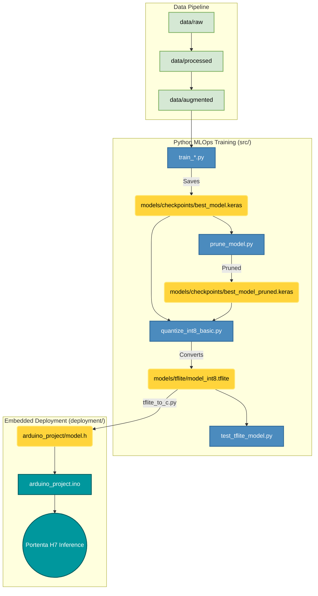

# TinyML-MLOps Framework for ARM Cortex-M7


An open-source, highly structured MLOps pipeline designed to optimize and deploy Deep Learning and Computer Vision models on resource-constrained microcontrollers (specifically the **Arduino Portenta H7**).

---

##  Overview

The **TinyML-MLOps Framework** bridges the gap between high-level Python model training and static, memory-constrained C++ embedded execution. It enforces strict data lifecycles, artifact management, and state-of-the-art compression pipelines (Pruning & Quantization) for deployment at the "Far Edge".

###  Key Features
- **Transfer Learning Support:** Automated pipelines for training advanced architectures including `MobileNetV2`, `MobileNetV3`, `ResNet18`, and `SqueezeNet`.
- **Object Detection at the Edge:** Natively supports training **FOMO** (Faster Objects, More Objects) for low-power visual detection.
- **Advanced Model Compression:** Built-in scripts for Polynomial Decay Pruning, Layer-Specific Sparse constraints, and Full Integer Quantization (INT8) to shrink models by up to 4x.
- **Hardware-in-the-Loop Integration:** Includes real-time serial streaming scripts to visualize live raw pixels captured directly from the Portenta H7 Vision Shield.
- **Academic Reproducibility:** Version-controlled models, dynamic TensorBoard logging, and rigid data hierarchies (`raw/`, `processed/`, `augmented/`).

---

##  Architecture & MLOps Pipeline

The project rigorously separates Data Science environments (`src/`) from Embedded Engineering firmware (`deployment/`).



---

## Core Scripts Overview (`src/`)

The framework relies on a suite of production-ready scripts in `src/` to automate the complete MLOps workflow:

### 1. Data Engineering
*   **`process_images.py`**: Converts raw dataset images (JPEG, PNG, BMP) to single-channel grayscale, applying optimized compression parameters (JPEG Quality: 70, PNG Compression: 9) to prevent bloating storage.
*   **`reshape_images.py`**: Recursively searches for images and resizes them to the target resolution required by models (e.g., `96x96`, `160x120`, `320x320`), storing the structured dataset in `data/processed/{width}x{height}`.

### 2. Model Training (ML Pipelines)
*   **`train_mobilenet.py`**: Training pipeline for MobileNet classification architectures (`MobileNet`, `MobileNetV2`, `MobileNetV3Large`, `MobileNetV3Small`) utilizing Transfer Learning from ImageNet weights, adapted to single-channel (grayscale) inputs and custom number of classes. Supports data augmentation and generates `.keras` models.
*   **`train_resnet18.py`**: Training pipeline for a standard `ResNet18` model architecture adapted for tiny edge classification.
*   **`train_squeezenet.py`**: Training pipeline for the ultra-lightweight `SqueezeNet` architecture, offering a balance between size and accuracy.
*   **`train_fomo.py`**: Trains a highly optimized **FOMO (Faster Objects, More Objects)** object detection model based on a MobileNetV2 backbone. Rather than utilizing expensive bounding boxes, it generates a cell-level presence heatmap on an $H/8$ or $H/16$ grid using smooth Focal Loss, fitting comfortably inside microcontrollers.

### 3. Model Optimization & Evaluation
*   **`prune_model.py`**: Applies manual magnitude-based unstructured pruning (either globally or layer-wise) to sparsify weights in Conv2D and Dense layers. Calculates and outputs initial/final model sparsity.
*   **`quantize_int8_basic.py`**: Quantizes standard FP32 `.keras` models to full-INT8 `.tflite` format. Employs a representative dataset of 100 samples from the processed dataset to precisely calibrate activation scales and zero-points. Enforces strict INT8 input/output tensors for optimal MCU compatibility.
*   **`test_model.py`**: Evaluates Keras `.keras` models by generating core statistics (Accuracy, Precision, Recall, F1-Score) and exporting a detailed classification report alongside a saved Seaborn-based Confusion Matrix plot.
*   **`test_tflite_model.py`**: Validates full-INT8 `.tflite` quantized models sequentially. Simulates microcontroller execution constraints by performing manual input scaling/quantization and output dequantization dynamically, exporting a Seaborn-based Confusion Matrix.

### 4. Embedded Conversion & Deployment
*   **`tflite_to_c.py`**: Standardized converter utility that parses a `.tflite` binary file and outputs a C/C++ array header compatible with TFLite for Microcontrollers. Embeds a critical 16-byte alignment attribute (`DATA_ALIGN_ATTRIBUTE`) required for hardware accelerators and optimal execution on ARM Cortex-M7 (e.g., Arduino Portenta H7).
*   **`compile_upload_arduino.py`**: Automation utility that interacts directly with `arduino-cli` to compile and upload the firmware. It handles core installations (`arduino:mbed_portenta`), auto-detects the connected board's COM port, and mitigates Windows path syntax issues natively.
*   **`send_multiple_images_serial.py`**: A robust hardware-in-the-loop evaluation script. It sends preprocessed dataset images to the Arduino Portenta via a custom Serial protocol (with byte escaping). It reads predictions back in real-time, matching them with the true folder-based classes to generate extensive statistical metrics and a Seaborn-based Confusion Matrix plot comparing Edge hardware inference with ground-truth.

---

## Quickstart & Usage

### 1. Prerequisites & Installation
Ensure you are using Python 3.10+ and install the dependencies:
```bash
git clone https://github.com/F4bian1012/Investigacion.git
cd Investigacion
pip install -r requirements.txt
```

### 2. Data Preparation
Place your raw image dataset inside `data/raw/` (organized by class subfolders), 
```
data/raw/
├── Class1/
├── Class2/
└── Class3/
```
then process and resize them with recommended sizes: 160x120, 320x240, 320x320 
```bash
python src/process_images.py
python src/reshape_images.py --width 160 --height 120
```

### 3. Model Training
Train a state-of-the-art vision architecture (e.g., MobileNetV2) using the command-line interface. The script will dynamically generate checkpoints and TensorBoard logs.
```bash 
python src/train_mobilenet.py --base_model MobileNetV2 --width 160 --height 120 --batch_size 32 --epochs 20 --learning_rate 0.0001
```

*For ResNet18, SqueezeNet, or FOMO, run `src/train_resnet18.py`, `src/train_squeezenet.py`, or `src/train_fomo.py` respectively.*

### 4. Model Evaluation
Evaluate your `.keras` model, automatically generating a Confusion Matrix and extensive statistical metrics (F1-score, Precision, Recall):
```bash
python src/test_model.py --width 96 --height 96
```

### 5. Optimization & INT8 Quantization
Convert the float32 Keras model into an ultra-lightweight integer-only TFLite model, strictly necessary for MCUs without a vector FPU:
```bash
python src/quantize_int8_basic.py --model_path models/checkpoints/best_model.keras 
```
*Note: You can validate the quantized model against the dataset using `python src/test_tflite_model.py`.*

### 6. Embedded Deployment
Once the model is optimized, convert the `.tflite` file into a C-array header for the Arduino IDE:
```bash
python src/tflite_to_c.py models/tflite/model_int8.tflite deployment/arduino_project_test/model.h --var_name model_tflite
```

Compile and upload the C++ firmware automatically to your Portenta H7 using our `arduino-cli` wrapper:
```bash
python src/compile_upload_arduino.py --path_proyecto deployment/arduino_project_test
```
*(Alternatively, you can open the project folder in the Arduino IDE and click Upload).*

### 7. Hardware-in-the-Loop Evaluation
Once the firmware is running on your Portenta H7, you can evaluate the model's physical performance directly on the edge hardware. Stream a test dataset over USB Serial and let the script compare the board's inferences with the real labels to generate metrics and a Confusion Matrix plot:
```bash
python src/send_multiple_images_serial.py --folder data/processed/160x120 --width 160 --height 120
```

---

## Experimental Sandbox (`src/Por_Depurar/`)
The `Por_Depurar/` directory is dedicated to experimental model optimization research:
- **`pruning_techniques.py`**: Explores Polynomial Decay and Layer-specific sparsity to reduce weight footprint.
- **`quantization_techniques.py`**: Compares Dynamic Range, Full Integer, Float16, and Quantization-Aware Training (QAT).
- **Legacy Baselines**: Contains the foundational `train_model.py` demonstrating a custom, from-scratch micro-CNN.

---

## Real-time Hardware Vision
We provide an end-to-end loop for raw data collection using the Arduino Portenta Vision Shield.
1. Flash `deployment/arduino/image_capture/image_capture.ino` to the Portenta H7.
2. Run the Python visualizer to view live serial pixel data (160x120 Grayscale at 30fps):
```bash
python src/Por_Depurar/visualize_serial_image.py
```

---

## Citation

If you use this framework in your academic research, please cite our upcoming *SoftwareX* paper:

```bibtex
@article{tinyml_mlops_2026,
  title={TinyML-MLOps: An Open-Source Structured Framework for Optimizing and Deploying Convolutional Neural Networks on ARM Cortex-M7 Microcontrollers},
  author={[J Villavisan]},
  journal={},
  year={},
  publisher={}
}
```

---
*Created for the tiny edge. Maintained by [F4bian1012](https://github.com/F4bian1012).*
