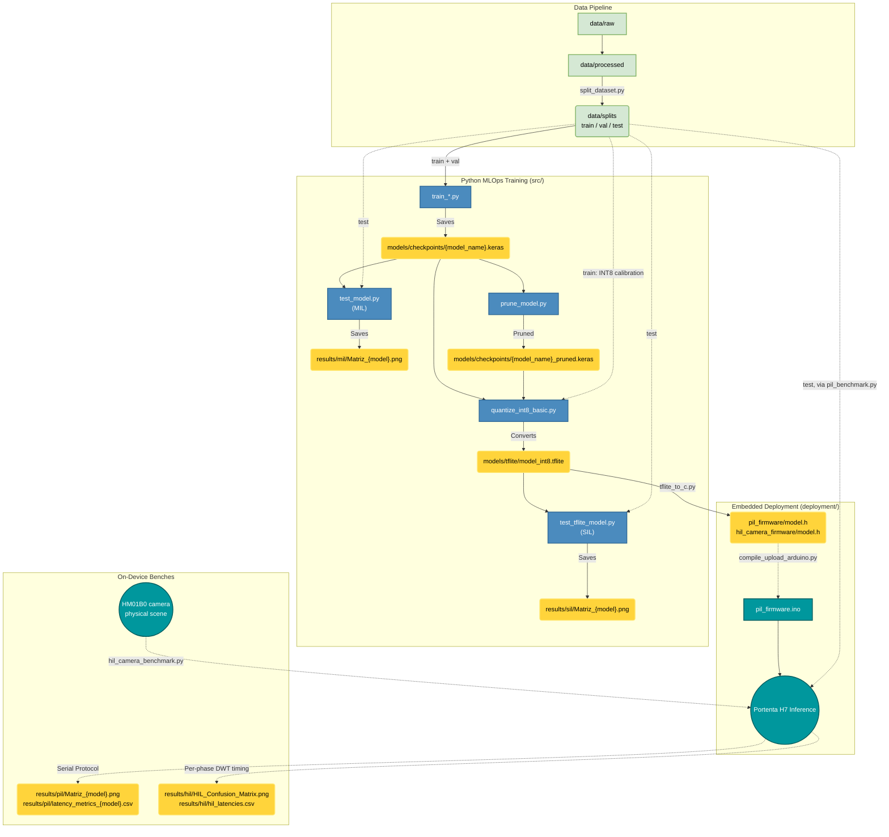

# PHLAME: Phase-Level And Microcontroller Evaluation


An open-source, highly structured MLOps framework — evaluated across a phase-level, four-tier Hardware-in-the-Loop fidelity ladder — designed to optimize and deploy Deep Learning and Computer Vision models on resource-constrained microcontrollers (specifically the **Arduino Portenta H7**).

---

## Table of Contents
- [Overview](#overview)
  - [Key Features](#key-features)
- [Architecture & MLOps Pipeline](#architecture--mlops-pipeline)
  - [Repository Structure](#repository-structure)
- [Serial Protocol (PIL Bench)](#serial-protocol-pil-bench)
- [Core Scripts Overview (`src/`)](#core-scripts-overview-src)
  - [1. Data Engineering](#1-data-engineering)
  - [2. Model Training (ML Pipelines)](#2-model-training-ml-pipelines)
  - [3. Model Optimization & Evaluation](#3-model-optimization--evaluation)
  - [4. Embedded Conversion & Deployment](#4-embedded-conversion--deployment)
  - [5. Camera-in-the-Loop HIL Evaluation](#5-camera-in-the-loop-hil-evaluation)
- [Hardware Requirements](#hardware-requirements)
- [Quickstart & Usage](#quickstart--usage)
  - [1. Prerequisites & Installation](#1-prerequisites--installation)
  - [2. Data Preparation](#2-data-preparation)
  - [3. Model Training](#3-model-training)
  - [4. Model Evaluation](#4-model-evaluation)
  - [5. Optimization & INT8 Quantization](#5-optimization--int8-quantization)
  - [6. Embedded Deployment](#6-embedded-deployment)
  - [7. Processor-in-the-Loop (PIL) Evaluation](#7-processor-in-the-loop-pil-evaluation)
  - [8. Hardware-in-the-Loop (HIL) Evaluation — Camera-in-the-Loop](#8-hardware-in-the-loop-hil-evaluation--camera-in-the-loop)
- [Citation](#citation)

---

## Overview

**PHLAME** (*Phase-Level And Microcontroller Evaluation*) is an open-source, reproducible software framework that covers the full cycle of training→INT8 quantization→deployment→phase-level measurement of CNN image classifiers on ARM Cortex-M microcontrollers. It organizes evaluation along a four-level fidelity ladder — **Model-in-the-Loop (MIL) → Software-in-the-Loop (SIL) → Processor-in-the-Loop (PIL) → Hardware-in-the-Loop (HIL)** — that makes the gap between desktop simulation and the physical device explicit and measurable at every step. Reuse beyond the framework's own application case is demonstrated on a standard TinyML benchmark (**Visual Wake Words**, one of the MLPerf Tiny tasks).

It bridges the gap between high-level Python model training and static, memory-constrained C++ embedded execution, enforcing strict data lifecycles, artifact management, and state-of-the-art compression pipelines (Pruning & Quantization) for deployment at the "Far Edge".

### Key Features
- **Fidelity-Ladder Evaluation (MIL→SIL→PIL→HIL):** Each level of realism — floating-point PC model, INT8-simulated PC model, real chip fed via serial, and real chip with a live camera in the loop — is a separately runnable, comparable artifact.
- **Per-Phase Latency Measurement:** On-device timing decomposed into pre-processing / inference / post-processing using the ARM Cortex-M7 DWT cycle counter.
- **Transfer Learning Support:** Automated pipelines for training advanced architectures including `MobileNetV2`, `MobileNetV3`, `ResNet18`, and `SqueezeNet`.
- **Advanced Model Compression:** Built-in scripts for Polynomial Decay Pruning, Layer-Specific Sparse constraints, and Full Integer Quantization (INT8) to shrink models by up to 4x.
- **Hardware-in-the-Loop Integration:** Real-time serial streaming and camera-in-the-loop evaluation on the Portenta H7 Vision Shield.
- **Academic Reproducibility:** Version-controlled models, dynamic TensorBoard logging, and rigid data hierarchies (`raw/`, `processed/`).

---

## Architecture & MLOps Pipeline

### Repository Structure
```text
phlame-tinyml/
├── data/                    # Local datasets (ignored in git)
│   ├── raw/                 # Raw unprocessed images
│   ├── processed/           # Resized & grayscale images
│   └── splits/              # Disjoint train/val/test partitions + manifests
├── deployment/              # C++ Firmware for edge deployment
│   ├── hil_camera_firmware/ # Portenta H7 Camera-in-the-Loop firmware
│   └── pil_firmware/        # Portenta H7 Processor-in-the-Loop firmware
├── models/                  # Generated Keras and TFLite models
│   ├── checkpoints/         # Trained .keras models
│   └── tflite/              # Quantized .tflite models
├── results/                 # One folder per fidelity level, named after the model
│   ├── mil/                 # Model-in-the-Loop (float, PC) confusion matrices
│   ├── sil/                 # Software-in-the-Loop (INT8 simulated, PC)
│   ├── pil/                 # Processor-in-the-Loop (real chip) + phase latencies
│   ├── hil/                 # Hardware-in-the-Loop (camera in the loop)
│   └── training_curves/     # Training/validation accuracy & loss plots
├── src/                     # Core Python MLOps scripts
│   ├── process_images.py    
│   ├── reshape_images.py    
│   ├── split_dataset.py     # Reproducible train/val/test partition
│   ├── train_*.py           # Training pipelines (MobileNet, ResNet, SqueezeNet)
│   ├── prune_model.py       
│   ├── quantize_int8_basic.py
│   ├── test_model.py        
│   ├── test_tflite_model.py 
│   ├── tflite_to_c.py       
│   ├── compile_upload_arduino.py
│   ├── pil_benchmark.py
│   └── hil_camera_benchmark.py
├── tensorboard_logs/        # Automated TF training logs
├── installed_packages.txt   # Pip freeze snapshot
├── requirements.txt         # Core dependencies & Hardware setup
└── README.md
```

The project rigorously separates Data Science environments (`src/`) from Embedded Engineering firmware (`deployment/`).



---

## Serial Protocol (PIL Bench)

> This section describes the **Processor-in-the-Loop (PIL)** protocol used by `pil_benchmark.py` / `pil_firmware.ino` (image injected over serial). The camera-in-the-loop **HIL** bench (`hil_camera_benchmark.py` / `hil_camera_firmware.ino`, section 5 below) uses a lighter single-byte trigger protocol (`'T'` to capture+infer, `'F1'`/`'F0'` to toggle frame-dump) — see that firmware's header comments for its handshake.

The PIL bench streams a full image from the host to the Portenta H7 over USB
Serial, runs on-device inference, and reads the predicted class back. The wire
format is a framed raw-byte protocol:

| Element        | Value            | Meaning                                        |
|----------------|------------------|------------------------------------------------|
| Start marker   | `#` (`0x23`)     | Begin of image packet                          |
| End marker     | `@` (`0x40`)     | End of image packet → triggers inference       |
| Escape byte    | `ESC` (`0x1B`)   | Next byte is real data, recovered as `b ^ 0x20`|
| Baud rate      | `115200`         | `Serial.begin(115200)`                         |

**Encoding rule.** Image pixels are sent raw between the markers. If a pixel byte
equals `#`, `@`, or `ESC`, the sender escapes it as `ESC` followed by
`byte ^ 0x20`, so control bytes never appear inside the payload. The firmware
reverses this on reception (`pil_benchmark.py` performs the escaping on the host
side).

**Input handling.** Received bytes (uint8, 0–255) are written into the model
input tensor. For an INT8 model each pixel is mapped as `int8 = pixel - 128`;
for a FP32 model as `float = pixel / 255.0`. If fewer bytes than the tensor
expects arrive, the remainder is zero-padded.

**Response.** After `Invoke()`, the board prints the predicted class index as a
single integer line (argmax of the output tensor). Diagnostic banners and the
on-chip CPU temperature (`°C`, from STM32H7 factory calibration) are also printed
around each inference; `pil_benchmark.py` parses the integer class from the stream.

---

## Core Scripts Overview (`src/`)

The framework relies on a suite of production-ready scripts in `src/` to automate the complete MLOps workflow:

### 1. Data Engineering
*   **`process_images.py`**: Converts raw dataset images (JPEG, PNG, BMP) to single-channel grayscale, applying optimized compression parameters (JPEG Quality: 70, PNG Compression: 9) to prevent bloating storage.
*   **`reshape_images.py`**: Recursively searches for images and resizes them to the target resolution required by models (e.g. `160x120`, `320x320`), storing the structured dataset in `data/processed/{width}x{height}`.

**Common Output Artifacts for Data Engineering:**
- **Grayscale Images**: `data/processed/grayscale/{class_name}/*.jpg` - The compressed, single-channel intermediate dataset.
- **Reshaped Datasets**: `data/processed/{width}x{height}/{class_name}/*.jpg` - The final model-ready dataset structured by resolution and class.

### 2. Model Training (ML Pipelines)
*   **`train_mobilenet.py`**: Training pipeline for MobileNet classification architectures (`MobileNet`, `MobileNetV2`, `MobileNetV3Large`, `MobileNetV3Small`) utilizing Transfer Learning from ImageNet weights, adapted to single-channel (grayscale) inputs and custom number of classes. Supports data augmentation and generates `.keras` models.
*   **`train_resnet.py`**: Training pipeline for ResNet classification architectures (`ResNet8`, `ResNet18`) adapted for tiny edge classification.
*   **`train_squeezenet.py`**: Training pipeline for the ultra-lightweight `SqueezeNet` architecture, offering a balance between size and accuracy.

**Common Input for Training Scripts:** the `train` and `val` partitions produced by `split_dataset.py` (`--splits_dir`, default `data/splits`). The scripts no longer accept `--validation_split` — the partition is fixed on disk instead of resampled in memory, so the hyper-parameter no longer appears in the artifact names either (`{model}+{batch}+{epochs}+{lr}+{W}+{H}`). If the partition is missing, training stops and prints the `split_dataset.py` command to run.

**Common Output Artifacts for Training Scripts:**
- **Keras Model**: `models/checkpoints/{model_name}+{hyperparameters}.keras` - The trained FP32 model ready for evaluation or quantization.
- **Class Names**: `models/class_names.txt` - Ordered list of class labels derived from the dataset structure.
- **Training History Plot**: `tensorboard_logs/{model_name}_training_history+{hyperparameters}.png` - Matplotlib visualization of training/validation loss and accuracy.

### 3. Model Optimization & Evaluation
*   **`test_model.py`**: The **MIL** level. Evaluates Keras `.keras` models by generating core statistics (Accuracy, Precision, Recall, F1-Score) and exporting a detailed classification report alongside a saved Seaborn-based Confusion Matrix plot. Requires an explicit `--model_path`, reads the held-out `data/splits/test` partition (`--data_dir`), never the full dataset, so the reported accuracy excludes the images the model trained on, and writes its Confusion Matrix to `results/mil/` alongside the other levels' outputs.
*   **`prune_model.py`**: Applies manual magnitude-based unstructured pruning (either globally or layer-wise) to sparsify weights in Conv2D and Dense layers. Calculates and outputs initial/final model sparsity.
*   **`quantize_int8_basic.py`**: Quantizes standard FP32 `.keras` models to full-INT8 `.tflite` format. Calibrates activation scales and zero-points with a representative dataset drawn **exclusively from `<splits_dir>/train`** (`--calib_samples`, default 100; `--calib_seed`, default 42, which fixes exactly which `.tflite` is produced). Calibrating on `test` would fit the activation ranges to the evaluation distribution and inflate the SIL/PIL/HIL accuracy; `val` is left out too, since early stopping already consumed it to select the model. Enforces strict INT8 input/output tensors for optimal MCU compatibility.
*   **`test_tflite_model.py`**: The **SIL** level. Validates full-INT8 `.tflite` quantized models sequentially. Simulates microcontroller execution constraints by performing manual input scaling/quantization and output dequantization dynamically, exporting a Seaborn-based Confusion Matrix. Reads `<splits_dir>/test` (`--splits_dir`, default `data/splits`) — the same partition MIL, PIL and HIL consume, and disjoint from the `train` split used to calibrate the quantization, so the MIL→SIL gap is attributable to quantization alone and not to a different sample of images. Writes its Confusion Matrix to `results/sil/`, named after the model like the other levels.

**Common Output Artifacts for Optimization & Evaluation:**
- **Confusion Matrix (MIL)**: `results/mil/Matriz_{model_name}.png` - Visual evaluation of the floating-point model's predictions on the held-out test partition.
- **Pruned Model**: `models/checkpoints/{model_name}_pruned.keras` - The sparse representation of the model after magnitude pruning.
- **Quantized TFLite Model**: `models/tflite/{model_name}_int8.tflite` - The fully integer quantized, microcontroller-ready binary file.
- **Confusion Matrix (SIL)**: `results/sil/Matriz_{model_name}_int8.png` - Visual evaluation of the quantized model simulating MCU arithmetic constraints.

### 4. Embedded Conversion & Deployment
*   **`tflite_to_c.py`**: Standardized converter utility that parses a `.tflite` binary file and outputs a C/C++ array header compatible with TFLite for Microcontrollers. Embeds a critical 16-byte alignment attribute (`DATA_ALIGN_ATTRIBUTE`) required for hardware accelerators and optimal execution on ARM Cortex-M7 (e.g., Arduino Portenta H7). Writes `model.h` into both firmware sketches by default (`--target pil|hil|both`), keeping the PIL and HIL benches on the same model; an explicit output path can still be passed as a second argument.
*   **`compile_upload_arduino.py`**: Automation utility that interacts directly with `arduino-cli` to compile and upload the firmware. `--target pil|hil` selects which of the two sketches to flash (the board runs one at a time). It handles core installations (`arduino:mbed_portenta`), auto-detects the connected board's COM port, and mitigates Windows path syntax issues natively.
*   **`pil_benchmark.py`**: The **PIL** level. It sends dataset images to the Arduino Portenta via a custom Serial protocol (with byte escaping). It reads predictions back in real-time, matching them with the true folder-based classes to generate extensive statistical metrics and a Seaborn-based Confusion Matrix plot comparing on-chip inference with ground-truth. Streams `<splits_dir>/test` by default (`--splits_dir`, default `data/splits`) — the same held-out partition MIL and SIL evaluate, so the SIL→PIL gap isolates the move to real silicon. Names its Confusion Matrix and latency CSV after the `--model_path` flashed on the board, matching `test_model.py`, so successive runs on different models accumulate instead of overwriting. Data is injected over the wire — the camera is not in the loop.

---

### 5. Camera-in-the-Loop HIL Evaluation
*   **`hil_camera_benchmark.py`**: The **true Hardware-in-the-Loop (HIL)** bench. The host displays each dataset image on-screen as a controlled visual stimulus; the Portenta's own **HM01B0 camera** captures the physical scene and runs the full sensor→prediction pipeline on-device, so ground truth is known by construction (the label of the displayed stimulus). Records per-phase latency (`CAPTURE`/`PRE`/`INF`/`POST`/`TOTAL`, via DWT cycle counter) and rig conditions (lux, distance, ambient temperature) alongside predictions. Optionally recovers the exact captured frame (`--dump-frames`) to cross-run it through the **MIL** (`--mil-model`) and **SIL** (`--sil-model`) levels on the PC, decomposing the end-to-end gap into its quantization (MIL vs SIL), execution (SIL vs HIL), and physical-frontend (PIL vs HIL) components.
    - Firmware companion: `deployment/hil_camera_firmware/hil_camera_firmware.ino` — a dedicated sketch, independent from the PIL firmware (`pil_firmware.ino`), which remains untouched as a serial-only fallback.
    - Outputs: `results/hil/HIL_Confusion_Matrix.png`, `results/hil/hil_latencies.csv` (one row per inference, all phase latencies + ground truth), `results/hil/hil_conditions.json` (rig protocol).

---

## Hardware Requirements

| Component        | Specification                                                        |
|------------------|---------------------------------------------------------------------|
| Board            | Arduino Portenta H7 (STM32H747XI, dual-core Cortex-M7 @ 480 MHz)     |
| External RAM     | 8 MB SDRAM (required — tensor arena + image buffer live here)        |
| Camera (capture) | Portenta Vision Shield, HM01B0 monochrome sensor (160×120, 30 fps)   |
| Flash            | 2 MB internal (holds the quantized model via `model.h`)              |
| Host link        | USB-C, 115200 baud serial                                            |

**Memory configuration (firmware).** The tensor arena is allocated in **SDRAM**,
not internal SRAM:

- `kTensorArenaSize = 4 * 1024 * 1024` (**4 MB**), 16-byte aligned.
- Image receive buffer: `IMAGE_BUFFER_SIZE = 400 * 1024` (400 KB), sized for up
  to 320×320 inputs.
- Op resolution uses `AllOpsResolver` (all TFLite-Micro ops registered) to avoid
  `AllocateTensors()` failures from missing operators, and to keep the firmware
  model-agnostic across the framework's supported architectures (MobileNetV2/V3,
  ResNet18, SqueezeNet) without per-model resolver maintenance — each architecture
  uses a different operator set (e.g. hard-swish/squeeze-excite in MobileNetV3,
  residual `Add` in ResNet18, `Concatenation` in SqueezeNet's fire modules), and
  `AllOpsResolver` avoids re-editing a fixed op list when switching models. This
  trades a larger firmware binary (all kernels linked, not just the ones the
  loaded model needs) for that flexibility — an acceptable trade on the Portenta
  H7's 2 MB flash.

**Toolchain.** Arduino CLI + `arduino:mbed_portenta` core + `Chirale_TensorFlowLite`
library (see `requirements.txt`).

---

## Quickstart & Usage

### 1. Prerequisites & Installation
Ensure you are using Python 3.10+ and install the dependencies:
```bash
git clone https://github.com/F4bian1012/phlame-tinyml.git
cd phlame-tinyml
pip install -r requirements.txt
```

### 2. Data Preparation
Place your raw image dataset inside `data/raw/` (organized by class subfolders), 
```
data/raw/
├── Class1/
└── Class2/
```
then process (convert to grayscale) and resize them with recommended sizes: CAMERA_R160x120 (QQVGA), CAMERA_R320x240 (QVGA), CAMERA_R320x320. 
```bash
python src/process_images.py --raw_path data/raw --path_processed data/processed/grayscale
python src/reshape_images.py --width 160 --height 120
```

Finally, partition the resized dataset into disjoint `train`/`val`/`test` splits. This step is **required** before training: materializing the partition on disk is what guarantees that every level of the fidelity ladder evaluates exactly the same held-out images, instead of each stage re-sampling the full directory (which leaks training data into the reported accuracy):
```bash
python src/split_dataset.py --input_dir data/processed/160x120 --output_dir data/splits --seed 42
```

### 3. Model Training
Train a state-of-the-art vision architecture (e.g., MobileNetV2) using the command-line interface. Training reads `data/splits/train` and `data/splits/val`, and fails with instructions if the partition is missing. The script will dynamically generate checkpoints and TensorBoard logs.
```bash 
python src/train_mobilenet.py --base_model MobileNetV2 --width 160 --height 120 --batch_size 32 --epochs 20 --learning_rate 0.0001
```

*For ResNet or SqueezeNet, run `src/train_resnet.py` or `src/train_squeezenet.py` respectively. All three accept `--splits_dir` (default `data/splits`) to point at a different partition.*

### 4. Model Evaluation
Evaluate your `.keras` model, automatically generating a Confusion Matrix and extensive statistical metrics (F1-score, Precision, Recall). You can explicitly specify the model you want to evaluate using the `--model_path` argument:
```bash
python src/test_model.py --width 160 --height 120 --model_path models/checkpoints/MobileNetV2+32+20+0.0001+160+120.keras
```
*(`--model_path` is required — there is no default checkpoint. `--data_dir` defaults to `data/splits/test`, and the Confusion Matrix is written to `results/mil/`.)*

### 5. Optimization & INT8 Quantization
Convert the float32 Keras model into an ultra-lightweight integer-only TFLite model, strictly necessary for MCUs without a vector FPU. Calibration samples come from `data/splits/train` only, so the evaluation partition stays untouched:
```bash
python src/quantize_int8_basic.py --model_path models/checkpoints/{model_name}.keras --calib_samples 100 --calib_seed 42
```
*(`--calib_seed` fixes the shuffle of the calibration images, so the same checkpoint always yields a bit-identical `.tflite`. `--splits_dir` defaults to `data/splits`.)*

Validate the quantized model at the **SIL** level, against the held-out test partition:
```bash
python src/test_tflite_model.py --model_path models/tflite/{model_name}_int8.tflite
```
*(Reads `data/splits/test` by default; override the partition root with `--splits_dir` or a single directory with `--data_dir`. The input geometry is taken from the model's own input tensor, so `--width`/`--height` are corrected automatically if they disagree.)*

### 6. Embedded Deployment
Once the model is optimized, convert the `.tflite` file into a C-array header for the Arduino IDE. By default the header is written into **both** firmware sketches (`deployment/pil_firmware/model.h` and `deployment/hil_camera_firmware/model.h`), so the PIL and HIL benches always run the same model:
```bash
python src/tflite_to_c.py models/tflite/{model_name}_int8.tflite
```

*(Use `--target pil` or `--target hil` to generate only one of them. Arduino sketches are self-contained folders, so each one needs its own copy of `model.h`. The generated symbol is `g_model`, which is what both `.ino` sketches reference in `tflite::GetModel()` — override it with `--var_name` only if you also change the firmware.)*

Compile and upload the C++ firmware automatically to your Portenta H7 using our `arduino-cli` wrapper. Select which of the two firmwares to flash with `--target` — the board runs one at a time, so there is no "both" option:
```bash
python src/compile_upload_arduino.py --target pil
```
*(Use `--target hil` for the camera-in-the-loop firmware of section 8. The board's port is auto-detected via `arduino-cli board list`, so no port argument is needed; `--path_proyecto` still accepts an arbitrary sketch folder. Alternatively, you can open the project folder in the Arduino IDE and click Upload).*

### 7. Processor-in-the-Loop (PIL) Evaluation
Once the firmware is running on your Portenta H7, you can evaluate the model's on-chip performance by injecting data over serial. The bench streams the held-out `data/splits/test` partition over USB Serial and compares the board's inferences with the real labels to generate metrics and a Confusion Matrix plot:
```bash
python src/pil_benchmark.py --model_path models/tflite/{model_name}_int8.tflite --width 160 --height 120 --port COM9 --baud 115200
```
*(This is Processor-in-the-Loop: the real chip runs inference, but the image is injected over the wire — the camera and physical scene are not part of the loop. `--model_path` is not loaded on the host: it names the run's artifacts after the model flashed on the board, the same convention `test_model.py` uses, so benchmarking a second model no longer overwrites the first one's results. Override the partition root with `--splits_dir`, or send an arbitrary folder with `--folder`; `--count N` sends a random subset. Note `--width`/`--height` default to 320×320, so pass them explicitly for a 160×120 model.)*

**Common Output Artifacts for PIL Evaluation:**
- **Confusion Matrix (PIL)**: `results/pil/Matriz_{model_name}_int8.png` - Visual evaluation of the on-chip inference compared with real labels.
- **Per-Phase Latencies (PIL)**: `results/pil/latency_metrics_{model_name}_int8.csv` - One row per image with `CYC_*`/`US_*` phase latencies and MCU temperature.

### 8. Hardware-in-the-Loop (HIL) Evaluation — Camera-in-the-Loop
Flash the camera-enabled sketch with `python src/compile_upload_arduino.py --target hil` (dedicated firmware, independent from the PIL one). Then run the camera-in-the-loop bench: the host displays each stimulus image full-screen, the Portenta's HM01B0 camera captures the physical scene, and the script matches the on-device prediction with the known stimulus label:
```bash
python src/hil_camera_benchmark.py --port COM9 --folder data/processed/160x120 --count 100 \
    --settle 1.5 --lux 320 --distance-cm 25 \
    --sil-model models/tflite/model_int8.tflite --mil-model models/checkpoints/best_model.keras
```
*(This is the true Hardware-in-the-Loop level: ground truth is known by construction from the displayed stimulus, and `--sil-model`/`--mil-model` enable cross-running the exact captured frame through the lower fidelity levels to decompose the gap.)*

**Common Output Artifacts for HIL Evaluation:**
- **Confusion Matrix (HIL)**: `results/hil/HIL_Confusion_Matrix.png` - Visual evaluation of the camera-in-the-loop inference compared with the stimulus ground truth.
- **Per-Phase Latencies**: `results/hil/hil_latencies.csv` - One row per inference with `CAPTURE`/`PRE`/`INF`/`POST`/`TOTAL` latency, MCU temperature, and ground truth.
- **Rig Conditions**: `results/hil/hil_conditions.json` - Environmental protocol of the stimulus rig (lux, distance, ambient temperature, notes).

---

## Citation

If you use this framework in your academic research, please cite our upcoming *SoftwareX* paper:

```bibtex
@article{phlame_2026,
  title={PHLAME: A Phase-Level Hardware-in-the-Loop Framework for Reproducible Fidelity-Ladder Evaluation of TinyML Image Classifiers on ARM Cortex-M Microcontrollers},
  author={Villavisan, J.},
  journal={SoftwareX},
  year={2026},
  publisher={Elsevier}
}
```

Repository: [github.com/F4bian1012/phlame-tinyml](https://github.com/F4bian1012/phlame-tinyml)

---
*Created for the tiny edge. Maintained by [F4bian1012](https://github.com/F4bian1012).*
